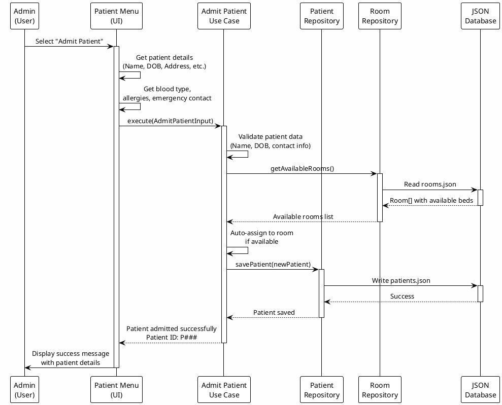
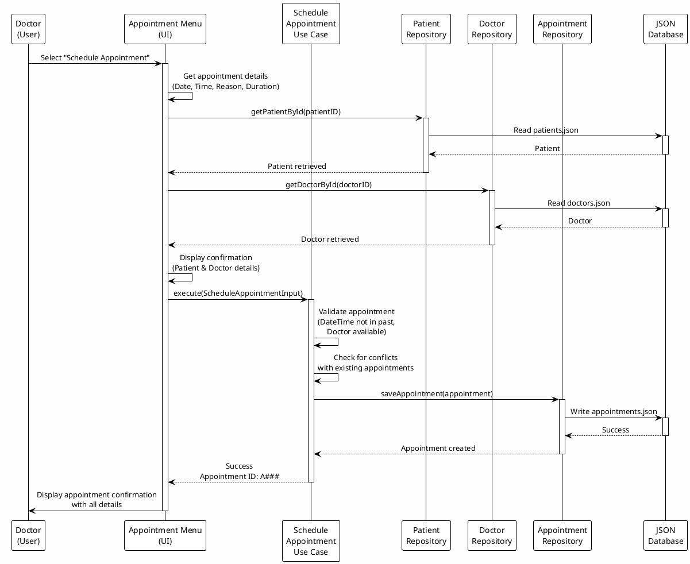
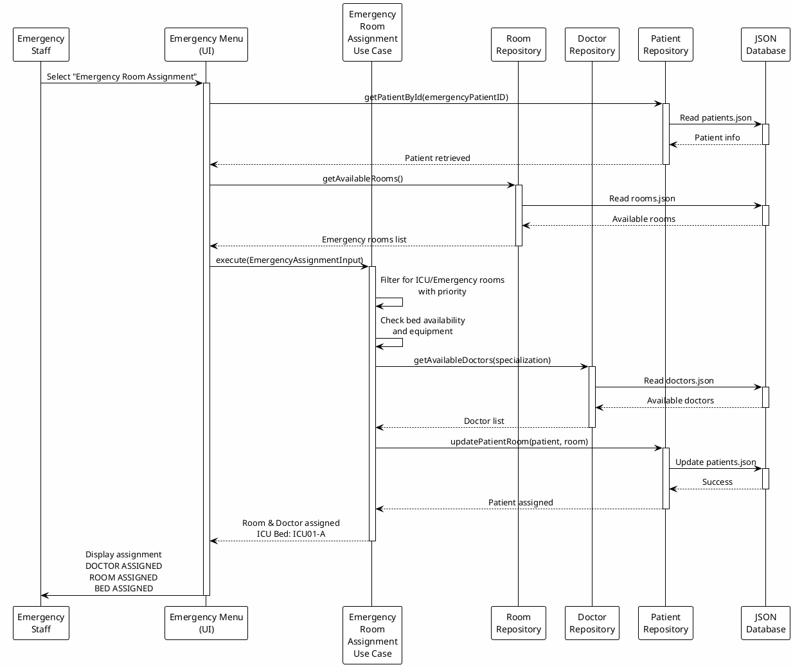
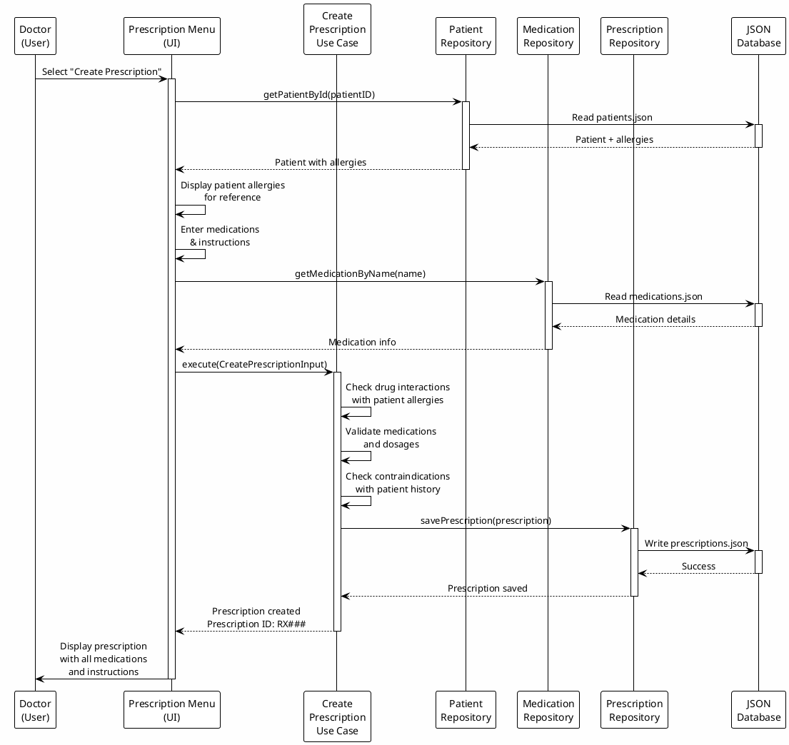

# 🎨 Hospital Management System - UML, Use Case & Sequence Diagrams

## 📑 Table of Contents
1. [Class UML Diagram](#1-class-uml-diagram)
2. [Use Case Diagram](#2-use-case-diagram)
3. [Sequence Diagrams](#3-sequence-diagrams)
   - [Patient Admission Flow](#patient-admission-flow)
   - [Appointment Scheduling Flow](#appointment-scheduling-flow)
   - [Emergency Room Assignment Flow](#emergency-room-assignment-flow)
   - [Prescription Creation Flow](#prescription-creation-flow)

---

## 1. Class UML Diagram

### Complete Class Structure

```plantuml
@startuml Hospital_Management_Classes

!theme plain
skinparam backgroundColor #FEFEFE
skinparam classBorderColor #333
skinparam arrowColor #333
skinparam classBackgroundColor #F8F8F8

' ============== BASE CLASSES ==============
abstract class Person {
  {field} -name: String
  {field} -dateOfBirth: String
  {field} -address: String
  {field} -tel: String
  --
  {method} +getName(): String
  {method} +getDateOfBirth(): String
  {method} +getAddress(): String
  {method} +getTel(): String
  {method} #validatePerson(): void
  {method} #validatePhoneNumber(): void
  {method} #validateDateOfBirth(): void
}

abstract class Staff extends Person {
  {field} -staffID: String
  {field} -hireDate: DateTime
  {field} -salary: double
  {field} -schedule: Map<String, List<DateTime>>
  --
  {method} +getStaffID(): String
  {method} +getHireDate(): DateTime
  {method} +getSalary(): double
  {method} +getSchedule(): Map
  {method} +updateSalary(newSalary): void
  {method} #validateStaff(): void
}

' ============== PATIENT ==============
class Patient extends Person {
  {field} -patientID: String
  {field} -bloodType: String
  {field} -medicalRecords: List<String>
  {field} -allergies: List<String>
  {field} -emergencyContact: String
  {field} -assignedDoctors: List<Doctor>
  {field} -assignedNurses: List<Nurse>
  {field} -prescriptions: List<Prescription>
  {field} -currentRoom: Room?
  {field} -currentBed: Bed?
  {field} -hasNextMeeting: bool
  {field} -nextMeetingDate: DateTime?
  {field} -nextMeetingDoctor: Doctor?
  --
  {method} +getPatientID(): String
  {method} +getBloodType(): String
  {method} +getMedicalRecords(): List
  {method} +getAllergies(): List
  {method} +getEmergencyContact(): String
  {method} +getAssignedDoctors(): List<Doctor>
  {method} +getAssignedNurses(): List<Nurse>
  {method} +getPrescriptions(): List<Prescription>
  {method} +getCurrentRoom(): Room?
  {method} +getCurrentBed(): Bed?
  {method} +addAllergy(allergy): void
  {method} +addMedicalRecord(record): void
  {method} +assignDoctor(doctor): void
  {method} +removeDoctor(doctor): void
  {method} +assignNurse(nurse): void
  {method} +removeNurse(nurse): void
  {method} +scheduleNextMeeting(date, doctor): void
  {method} +assignToBed(room, bed): void
  {method} +discharge(): void
}

' ============== DOCTOR ==============
class Doctor extends Staff {
  {field} -specialization: String
  {field} -certifications: List<String>
  {field} -currentPatients: List<Patient>
  {field} -workingHours: Map<String, Map<String, String>>
  --
  {method} +getSpecialization(): String
  {method} +getCertifications(): List
  {method} +getCurrentPatients(): List<Patient>
  {method} +getPatientCount(): int
  {method} +getWorkingHours(): Map
  {method} +addPatient(patient): void
  {method} +removePatient(patient): void
  {method} +hasCertification(cert): bool
  {method} +addCertification(cert): void
  {method} +isAvailable(dateTime): bool
}

' ============== NURSE ==============
class Nurse extends Staff {
  {field} -assignedRooms: List<Room>
  {field} -assignedPatients: List<Patient>
  --
  {method} +getAssignedRooms(): List<Room>
  {method} +getAssignedPatients(): List<Patient>
  {method} +assignRoom(room): void
  {method} +removeRoom(room): void
  {method} +assignPatient(patient): void
  {method} +removePatient(patient): void
}

' ============== ADMINISTRATIVE ==============
class Administrative extends Staff {
  {field} -department: String
  {field} -permissions: List<String>
  --
  {method} +getDepartment(): String
  {method} +getPermissions(): List
  {method} +hasPermission(permission): bool
  {method} +addPermission(permission): void
}

' ============== APPOINTMENT ==============
class Appointment {
  {field} -id: String
  {field} -dateTime: DateTime
  {field} -duration: int
  {field} -patient: Patient
  {field} -doctor: Doctor
  {field} -room: Room?
  {field} -status: AppointmentStatus
  {field} -reason: String
  {field} -notes: String?
  --
  {method} +getId(): String
  {method} +getDateTime(): DateTime
  {method} +getDuration(): int
  {method} +getPatient(): Patient
  {method} +getDoctor(): Doctor
  {method} +getRoom(): Room?
  {method} +getStatus(): AppointmentStatus
  {method} +getReason(): String
  {method} +getNotes(): String?
  {method} +updateStatus(status): void
  {method} +isUpcoming(): bool
  {method} +getFormattedDate(): String
  {method} +getFormattedTime(): String
}

enum AppointmentStatus {
  SCHEDULED
  COMPLETED
  CANCELLED
  NO_SHOW
  RESCHEDULED
}

' ============== PRESCRIPTION ==============
class Prescription {
  {field} -id: String
  {field} -time: DateTime
  {field} -medications: List<Medication>
  {field} -instructions: String
  {field} -prescribedBy: Doctor
  {field} -prescribedTo: Patient
  --
  {method} +getId(): String
  {method} +getTime(): DateTime
  {method} +getMedications(): List<Medication>
  {method} +getInstructions(): String
  {method} +getPrescribedBy(): Doctor
  {method} +getPrescribedTo(): Patient
  {method} +getMedicationCount(): int
  {method} +addMedication(med): void
  {method} +removeMedication(med): void
}

class Medication {
  {field} -id: String
  {field} -name: String
  {field} -dosage: String
  {field} -sideEffects: List<String>
  {field} -contraindications: List<String>
  --
  {method} +getId(): String
  {method} +getName(): String
  {method} +getDosage(): String
  {method} +getSideEffects(): List
  {method} +getContraindications(): List
}

' ============== ROOM ==============
class Room {
  {field} -roomId: String
  {field} -number: String
  {field} -roomType: RoomType
  {field} -status: RoomStatus
  {field} -equipment: List<Equipment>
  {field} -beds: List<Bed>
  --
  {method} +getRoomId(): String
  {method} +getNumber(): String
  {method} +getRoomType(): RoomType
  {method} +getStatus(): RoomStatus
  {method} +getEquipment(): List<Equipment>
  {method} +getBeds(): List<Bed>
  {method} +getAvailableBeds(): List<Bed>
  {method} +hasAvailableBeds(): bool
  {method} +getAvailableBedCount(): int
  {method} +updateStatus(status): void
  {method} +addEquipment(equip): void
  {method} +removeEquipment(equipId): void
  {method} +getOperationalEquipment(): List<Equipment>
  {method} +assignPatientToBed(patient, bed): bool
  {method} +dischargePatient(patient): void
}

enum RoomType {
  GENERAL_WARD
  PRIVATE_ROOM
  ICU
  PEDIATRIC
  MATERNITY
  ISOLATION
  EMERGENCY
}

enum RoomStatus {
  AVAILABLE
  OCCUPIED
  UNDER_MAINTENANCE
  RESERVED
  CLOSED
}

' ============== BED ==============
class Bed {
  {field} -bedNumber: String
  {field} -bedType: BedType
  {field} -isOccupied: bool
  {field} -currentPatient: Patient?
  {field} -features: List<String>
  --
  {method} +getBedNumber(): String
  {method} +getBedType(): BedType
  {method} +isOccupied(): bool
  {method} +getCurrentPatient(): Patient?
  {method} +getFeatures(): List
  {method} +isAvailable(): bool
  {method} +assignPatient(patient): void
  {method} +removePatient(): void
}

enum BedType {
  STANDARD
  PREMIUM
  ICU_BED
  PEDIATRIC_BED
  STRETCHER
}

' ============== EQUIPMENT ==============
class Equipment {
  {field} -equipmentId: String
  {field} -name: String
  {field} -type: String
  {field} -status: EquipmentStatus
  {field} -maintenanceDate: DateTime?
  {field} -location: String
  --
  {method} +getEquipmentId(): String
  {method} +getName(): String
  {method} +getType(): String
  {method} +getStatus(): EquipmentStatus
  {method} +getMaintenanceDate(): DateTime?
  {method} +getLocation(): String
  {method} +updateStatus(status): void
  {method} +scheduleMaintenance(date): void
  {method} +isOperational(): bool
}

enum EquipmentStatus {
  OPERATIONAL
  UNDER_MAINTENANCE
  BROKEN
  DEPRECATED
}

' ============== RELATIONSHIPS ==============
Patient "1" -- "0..*" Doctor : "assigned to"
Patient "1" -- "0..*" Nurse : "cared by"
Patient "1" -- "0..*" Prescription : "has"
Patient "1" -- "0..1" Room : "stays in"
Patient "1" -- "0..1" Bed : "occupies"

Doctor "1" -- "0..*" Patient : "manages"
Doctor "1" -- "0..*" Appointment : "conducts"
Doctor "1" -- "0..*" Prescription : "prescribes"

Nurse "1" -- "0..*" Room : "assigned to"
Nurse "1" -- "0..*" Patient : "cares for"

Appointment "1" -- "1" Patient : "involves"
Appointment "1" -- "1" Doctor : "conducted by"
Appointment "1" -- "0..1" Room : "held in"

Prescription "1" -- "1" Doctor : "prescribed by"
Prescription "1" -- "1" Patient : "prescribed to"
Prescription "1" -- "1..*" Medication : "contains"

Room "1" -- "1..*" Bed : "contains"
Room "1" -- "0..*" Equipment : "has"
Room "1" -- "0..*" Patient : "houses"

Bed "1" -- "0..1" Patient : "occupied by"

Staff "1" -- "0..*" Administrative : "can be"

@enduml
```



---

## 2. Use Case Diagram

### Hospital Management System Use Cases

```plantuml
@startuml Hospital_Management_UseCases

!theme plain
skinparam backgroundColor #FEFEFE
skinparam actorBorderColor #333
skinparam usecaseBorderColor #333
skinparam arrowColor #333

actor Patient as P
actor Doctor as D
actor Nurse as N
actor Admin as A
actor Emergency as E

usecase "Manage Patients" as UC1
usecase "View Patient Profile" as UC1_1
usecase "Admit Patient" as UC1_2
usecase "Update Patient Records" as UC1_3
usecase "Discharge Patient" as UC1_4

usecase "Manage Doctors" as UC2
usecase "Register Doctor" as UC2_1
usecase "View Doctor Info" as UC2_2
usecase "Update Specialization" as UC2_3
usecase "Assign to Patient" as UC2_4

usecase "Manage Appointments" as UC3
usecase "Schedule Appointment" as UC3_1
usecase "Reschedule Appointment" as UC3_2
usecase "Cancel Appointment" as UC3_3
usecase "Complete Appointment" as UC3_4
usecase "View Appointment Schedule" as UC3_5

usecase "Manage Prescriptions" as UC4
usecase "Create Prescription" as UC4_1
usecase "View Prescription" as UC4_2
usecase "Check Drug Interactions" as UC4_3
usecase "Refill Prescription" as UC4_4

usecase "Manage Rooms" as UC5
usecase "Add Room" as UC5_1
usecase "View Available Rooms" as UC5_2
usecase "Assign Patient to Room" as UC5_3
usecase "Update Room Status" as UC5_4
usecase "Manage Equipment" as UC5_5

usecase "Manage Nurses" as UC6
usecase "Assign Rooms to Nurse" as UC6_1
usecase "Assign Patients to Nurse" as UC6_2
usecase "View Nurse Schedule" as UC6_3

usecase "Emergency Operations" as UC7
usecase "Register Emergency Patient" as UC7_1
usecase "Find Emergency Room" as UC7_2
usecase "Assign Emergency Doctor" as UC7_3
usecase "Priority Assignment" as UC7_4

usecase "Search Operations" as UC8
usecase "Search Patient" as UC8_1
usecase "Search Doctor" as UC8_2
usecase "Search Room" as UC8_3
usecase "Advanced Search" as UC8_4

' Main actors to main use cases
P --> UC1
D --> UC2
D --> UC3
D --> UC4
D --> UC8
N --> UC6
N --> UC8
A --> UC5
E --> UC7
E --> UC8

' Patient use case hierarchy
UC1 --> UC1_1
UC1 --> UC1_2
UC1 --> UC1_3
UC1 --> UC1_4

' Doctor use case hierarchy
UC2 --> UC2_1
UC2 --> UC2_2
UC2 --> UC2_3
UC2 --> UC2_4

' Appointment use case hierarchy
UC3 --> UC3_1
UC3 --> UC3_2
UC3 --> UC3_3
UC3 --> UC3_4
UC3 --> UC3_5

' Prescription use case hierarchy
UC4 --> UC4_1
UC4 --> UC4_2
UC4 --> UC4_3
UC4 --> UC4_4

' Room use case hierarchy
UC5 --> UC5_1
UC5 --> UC5_2
UC5 --> UC5_3
UC5 --> UC5_4
UC5 --> UC5_5

' Nurse use case hierarchy
UC6 --> UC6_1
UC6 --> UC6_2
UC6 --> UC6_3

' Emergency use case hierarchy
UC7 --> UC7_1
UC7 --> UC7_2
UC7 --> UC7_3
UC7 --> UC7_4

' Search use case hierarchy
UC8 --> UC8_1
UC8 --> UC8_2
UC8 --> UC8_3
UC8 --> UC8_4

@enduml
```



---

## 3. Sequence Diagrams

### Patient Admission Flow



### Appointment Scheduling Flow



### Emergency Room Assignment Flow



### Prescription Creation Flow



---

## Key Relationships Summary

| Entity | Relationship | Related To | Cardinality |
|--------|-------------|-----------|-------------|
| Patient | Assigned to | Doctor | 0..* to 0..* |
| Patient | Cared by | Nurse | 0..* to 0..* |
| Patient | Has | Prescription | 1 to 0..* |
| Patient | Stays in | Room | 1 to 0..1 |
| Patient | Occupies | Bed | 1 to 0..1 |
| Doctor | Manages | Patient | 1 to 0..* |
| Doctor | Conducts | Appointment | 1 to 0..* |
| Doctor | Prescribes | Prescription | 1 to 0..* |
| Doctor | Extends | Staff | - |
| Nurse | Assigned to | Room | 1 to 0..* |
| Nurse | Cares for | Patient | 1 to 0..* |
| Nurse | Extends | Staff | - |
| Staff | Extends | Person | - |
| Appointment | Involves | Patient | 1 to 1 |
| Appointment | Conducted by | Doctor | 1 to 1 |
| Appointment | Held in | Room | 1 to 0..1 |
| Prescription | Prescribed by | Doctor | 1 to 1 |
| Prescription | Prescribed to | Patient | 1 to 1 |
| Prescription | Contains | Medication | 1 to 1..* |
| Room | Contains | Bed | 1 to 1..* |
| Room | Has | Equipment | 1 to 0..* |
| Room | Houses | Patient | 1 to 0..* |
| Bed | Occupied by | Patient | 1 to 0..1 |

---

## Design Patterns Used

### 1. **Repository Pattern**
```
Domain defines interface → Data implements it
```
- Abstracts data access
- Allows multiple implementations
- Easy testing with mocks

### 2. **Use Case Pattern**
```
Input → Validation → Business Logic → Output
```
- Encapsulates business rules
- Reusable across menus
- Clear error handling

### 3. **Entity Pattern**
```
Immutable objects with business logic
```
- Ensures data consistency
- Private fields with public getters
- Built-in validation

### 4. **Dependency Injection**
```
Repositories injected into use cases
```
- Loose coupling
- Easy testing
- Clear dependencies

---

## Data Flow Architecture

```
PRESENTATION LAYER
    ↓ (calls Use Cases)
DOMAIN LAYER (Business Logic)
    ↓ (implements)
REPOSITORY INTERFACES
    ↓ (implemented by)
DATA LAYER
    ↓ (reads/writes)
JSON DATABASE
```

Each layer maintains separation of concerns:
- **Presentation**: UI and user interaction
- **Domain**: Business logic and rules
- **Data**: Storage and persistence

---

## Entity Hierarchy

```
Person (Abstract)
├── Patient (Concrete)
│   └── Related: Doctor, Nurse, Room, Bed, Prescription
└── Staff (Abstract)
    ├── Doctor (Concrete)
    │   └── Related: Patient, Appointment, Prescription
    ├── Nurse (Concrete)
    │   └── Related: Patient, Room
    └── Administrative (Concrete)
        └── Related: System permissions

Other Entities:
├── Appointment (Doctor ↔ Patient)
├── Prescription (Doctor → Patient)
│   └── Medication (In Prescription)
├── Room (Staff assigns Patient)
│   ├── Bed (In Room)
│   └── Equipment (In Room)
```

---

## Conclusion

This comprehensive diagram set shows:

✅ **Class Relationships** - How entities connect and interact
✅ **Use Cases** - What users can do in the system
✅ **Workflows** - How data flows through operations
✅ **Design Patterns** - Architecture and best practices

All diagrams can be rendered using PlantUML online viewer or integrated into documentation.
